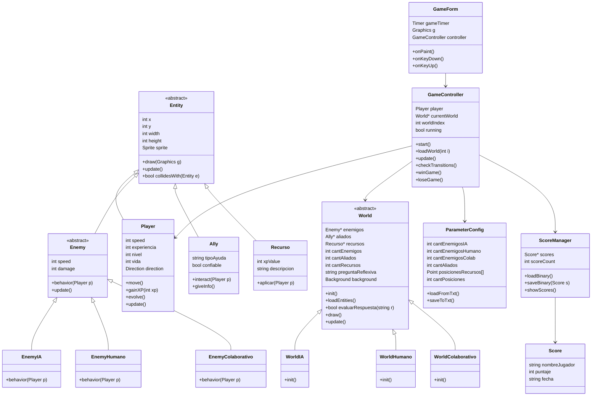

# Algoritmos_grupo_1

Prueba de Diagrama:

```mermaid
classDiagram

%%=====================================
%%           ENTIDAD BASE
%%=====================================
class Entity {
  <<abstract>>
  int x
  int y
  int width
  int height
  Sprite sprite
  +draw(Graphics g)
  +update()
  +bool collidesWith(Entity e)
}

%%=====================================
%%              PLAYER
%%=====================================
Entity <|-- Player

class Player {
  int speed
  int experiencia
  int nivel
  int vida
  Direction direction
  +move()
  +gainXP(int xp)
  +evolve()
  +update()
}

%%=====================================
%%              ENEMIGOS
%%=====================================
Entity <|-- Enemy
Enemy <|-- EnemyIA
Enemy <|-- EnemyHumano
Enemy <|-- EnemyColaborativo

class Enemy {
  <<abstract>>
  int speed
  int damage
  +behavior(Player p)
  +update()
}

class EnemyIA {
  +behavior(Player p)
}

class EnemyHumano {
  +behavior(Player p)
}

class EnemyColaborativo {
  +behavior(Player p)
}

%%=====================================
%%         ALIADOS Y RECURSOS
%%=====================================
Entity <|-- Ally
Entity <|-- Recurso

class Ally {
  string tipoAyuda
  bool confiable
  +interact(Player p)
  +giveInfo()
}

class Recurso {
  int xpValue
  string descripcion
  +aplicar(Player p)
}

%%=====================================
%%               MUNDOS
%%=====================================
class World {
  <<abstract>>
  Enemy* enemigos
  Ally* aliados
  Recurso* recursos
  int cantEnemigos
  int cantAliados
  int cantRecursos
  string preguntaReflexiva
  Background background
  +init()
  +loadEntities()
  +bool evaluarRespuesta(string r)
  +draw()
  +update()
}

World <|-- WorldIA
World <|-- WorldHumano
World <|-- WorldColaborativo

class WorldIA {
  +init()
}

class WorldHumano {
  +init()
}

class WorldColaborativo {
  +init()
}

%%=====================================
%%      CONTROLADOR DEL JUEGO
%%=====================================
class GameController {
  Player player
  World* currentWorld
  int worldIndex
  bool running
  +start()
  +loadWorld(int i)
  +update()
  +checkTransitions()
  +winGame()
  +loseGame()
}

class GameForm {
  Timer gameTimer
  Graphics g
  GameController controller
  +onPaint()
  +onKeyDown()
  +onKeyUp()
}

GameForm --> GameController
GameController --> Player
GameController --> World

%%=====================================
%%       ARCHIVOS Y PUNTAJES
%%=====================================
class ParameterConfig {
  int cantEnemigosIA
  int cantEnemigosHumano
  int cantEnemigosColab
  int cantAliados
  Point posicionesRecursos[]
  int cantPosiciones
  +loadFromTxt()
  +saveToTxt()
}

class Score {
  string nombreJugador
  int puntaje
  string fecha
}

class ScoreManager {
  Score* scores
  int scoreCount
  +loadBinary()
  +saveBinary(Score s)
  +showScores()
}

GameController --> ParameterConfig
GameController --> ScoreManager
ScoreManager --> Score
```
